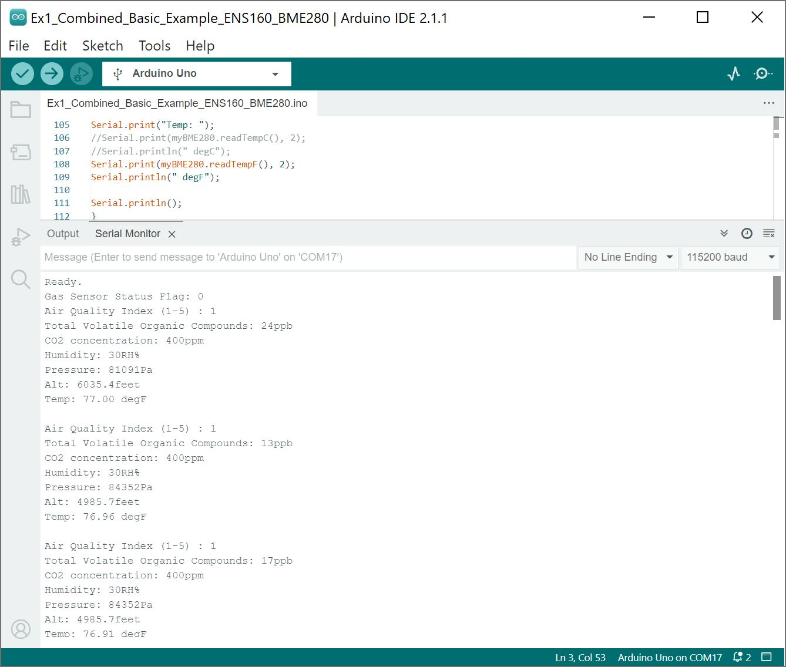
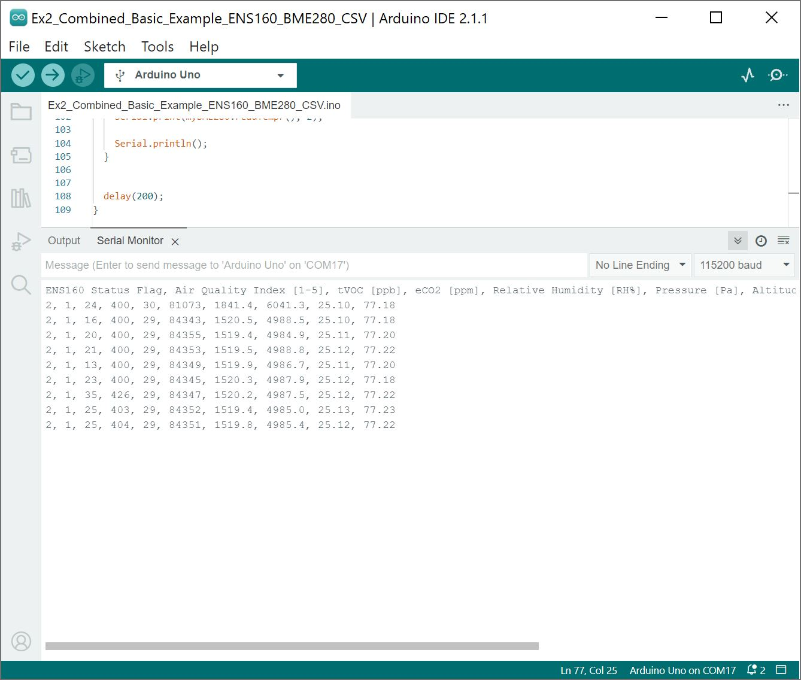
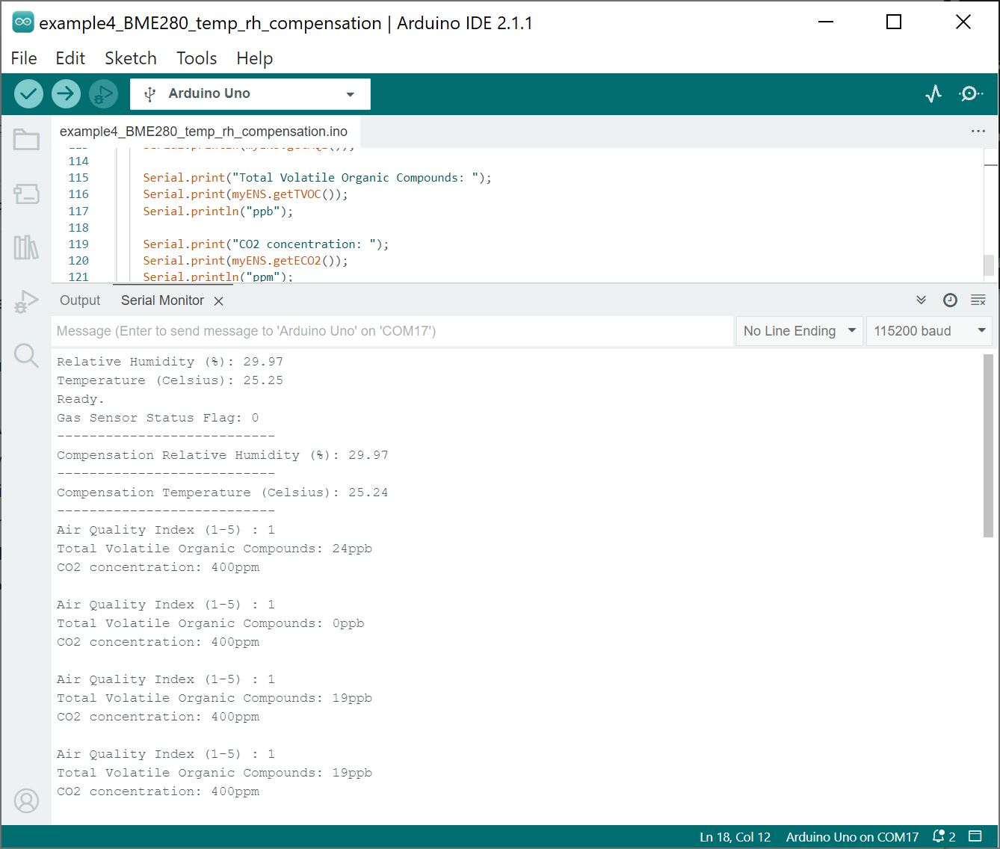

Now that we have our library installed, we can get started playing around with our examples for each sensor. For the scope of this tutorial, we will combine the basic examples to output the values to a Serial Monitor. Then we will use the BME280's temperature and relative humidity. From there we will be able to build our own custom code to integrate the sensor into a project.


### Example 1: ENS160 and BME280 Combined Examples

Below is the combined example to read ENS160 and BME280. Copy and paste the code below in your Arduino IDE.

<!--

"https://raw.githubusercontent.com/sparkfun/SparkFun_Environmental_Combo_Breakout_ENS160_BME280_QWIIC/main/Firmware/Ex1_Combined_Basic_Example_ENS160_BME280/Ex1_Combined_Basic_Example_ENS160_BME280.ino"

-->

??? code "Example 1: ENS160 and BME280 Combined Examples"
    === "Ex1_Combined_Basic_Example_ENS160_BME280.ino"
        ``` c++ linenums="1"
        /* Ex1_Combined_Basic_Example_ENS160_BME280.ino

        This example shows basic data retrieval from the SparkFun Environmental Combo Breakout
        from the Air Quality Sensor (ENS160) and Atmospheric Sensor (BME280).

        This example shows how to read sensor readings from the ENS160 (air quality index tVOC, and eCO2)
        and BME280 (humidity, pressure, and current temperature) over I2C.

        Modified by:
        Ho Yun "Bobby" Chan @ SparkFun Electronics August, 2023
        Basic Example for the ENS160 Originally Written by:
        Elias Santistevan @ SparkFun Electronics October, 2022
        Basic Example for the ENS160 Originally Written by:
        Nathan Seidle @ SparkFun Electronics March 9th, 2018

        Products:
        Air Quality Sensor  (ENS160)             -  https://www.sparkfun.com/products/20844
        Humidity and Temperature Sensor (BME280) -  https://www.sparkfun.com/products/13676

        Repository:
        https://github.com/sparkfun/SparkFun_Indoor_Air_Quality_Sensor-ENS160_Arduino_Library

        SparkFun code, firmware, and software is released under the MIT
        License(http://opensource.org/licenses/MIT).

        */
        #define Serial SerialUSB  //Uncomment if you are using a native USB like the Atmega32U4 or SAMD21


        #include <Wire.h>
        #include "SparkFun_ENS160.h"  // Click here to get the library: http://librarymanager/All#SparkFun_ENS160
        #include "SparkFunBME280.h"   // Click here to get the library: http://librarymanager/All#SparkFun_BME280

        SparkFun_ENS160 myENS;
        BME280 myBME280;

        int ensStatus;

        void setup() {
          Wire.begin();

          Serial.begin(115200);

          if (!myENS.begin()) {
            Serial.println("Did not begin.");
            while (1)
              ;
          }

          if (myBME280.beginI2C() == false)  //Begin communication over I2C
          {
            Serial.println("The sensor did not respond. Please check wiring.");
            while (1)
              ;  //Freeze
          }

          // Reset the indoor air quality sensor's settings.
          if (myENS.setOperatingMode(SFE_ENS160_RESET))
            Serial.println("Ready.");

          delay(100);

          // Device needs to be set to idle to apply any settings.
          // myENS.setOperatingMode(SFE_ENS160_IDLE);

          // Set to standard operation
          // Others include SFE_ENS160_DEEP_SLEEP and SFE_ENS160_IDLE
          myENS.setOperatingMode(SFE_ENS160_STANDARD);

          // There are four values here:
          // 0 - Operating ok: Standard Operation
          // 1 - Warm-up: occurs for 3 minutes after power-on.
          // 2 - Initial Start-up: Occurs for the first hour of operation.
          //                                              and only once in sensor's lifetime.
          // 3 - No Valid Output
          ensStatus = myENS.getFlags();
          Serial.print("Gas Sensor Status Flag: ");
          Serial.println(ensStatus);
        }

        void loop() {
          if (myENS.checkDataStatus()) {
            Serial.print("Air Quality Index (1-5) : ");
            Serial.println(myENS.getAQI());

            Serial.print("Total Volatile Organic Compounds: ");
            Serial.print(myENS.getTVOC());
            Serial.println("ppb");

            Serial.print("CO2 concentration: ");
            Serial.print(myENS.getECO2());
            Serial.println("ppm");

            Serial.print("Humidity: ");
            Serial.print(myBME280.readFloatHumidity(), 0);
            Serial.println("RH%");

            Serial.print("Pressure: ");
            Serial.print(myBME280.readFloatPressure(), 0);
            Serial.println("Pa");

            Serial.print("Alt: ");
            //Serial.print(myBME280.readFloatAltitudeMeters(), 1);
            //Serial.println("meters");
            Serial.print(myBME280.readFloatAltitudeFeet(), 1);
            Serial.println("feet");

            Serial.print("Temp: ");
            //Serial.print(myBME280.readTempC(), 2);
            //Serial.println(" degC");
            Serial.print(myBME280.readTempF(), 2);
            Serial.println(" degF");

            Serial.println();
          }

        

          delay(200);
        }

        ```

Select your board in the Tools menu (in our case **Arduino Uno**) and the correct Port it enumerated on and click "Upload". After uploading the code, open the [Serial Monitor](https://learn.sparkfun.com/tutorials/terminal-basics) or terminal emulator of your choice with the baud rate set to **115200**.


<div style="text-align: center;">
  <table>
    <tr style="vertical-align:middle;">
     <td style="text-align: center; vertical-align: middle;"><a href="../assets/img/Output_Arduino_Combined_Basic_Example_ENS160_BME280.JPG"></a></td>
    </tr>
  </table>
</div>


!!! note
    Note that the ENS160 needs some time to calculate values as stated in the datasheet on page 15 and 16 before the measurements are reasonable. Try moving the `ensStatus` into the loop to monitor the reliability of the ENS160's output.

    #### Initial Start-Up

    <quote>Initial Start-Up is the time the ENS160 needs to exhibit reasonable air quality readings after its first ever power-on.

    The ENS160 sensor raw resistance signals and sensitivities will change upon first power-on. The change in resistance is greatest in the first 48 hours of operation. Therefore, the ENS160 employs a start-up algorithm, allowing eCO2, TVOC and AQI output signals to be used from first power-on after 1 hour of operation.</quote>

    #### Initial Warm-Up

    <quote>Further to “Initial Start-up” the conditioning or “Warm-up” period is the time required to achieve adequate sensor stability before measuring VOCs after idle periods or power-off. Typically, the ENS160 requires 3 minutes of warm-up until reasonable air quality readings can be expected.</quote>


### Example 2: Combined Basic Example ENS160/BME280 in CSV Format

Below is the same combined code but formatted for CSV. Copy and paste the code below in your Arduino IDE.

<!--

"https://raw.githubusercontent.com/sparkfun/SparkFun_Environmental_Combo_Breakout_ENS160_BME280_QWIIC/main/Firmware/Ex2_Combined_Basic_Example_ENS160_BME280_CSV/Ex2_Combined_Basic_Example_ENS160_BME280_CSV.ino"

-->

??? code "Example 2: Combined Basic Example ENS160/BME280 in CSV Format"
    === "Ex2_Combined_Basic_Example_ENS160_BME280_CSV.ino"
        ``` c++ linenums="1"
        /* Ex2_Combined_Basic_Example_ENS160_BME280_CSV.ino

         This example shows basic data retrieval from the SparkFun Environmental Combo Breakout
         from the Air Quality Sensor (ENS160) and Atmospheric Sensor (BME280). This example shows
         how to read sensor readings from the ENS160 (air quality index tVOC, and eCO2)
         and BME280 (humidity, pressure, and current temperature) over I2C. The output format is
         in CSV.

         Modified by:
          Ho Yun "Bobby" Chan @ SparkFun Electronics August, 2023
         Basic Example for the ENS160 Originally Written by:
        	Elias Santistevan @ SparkFun Electronics October, 2022
         Basic Example for the ENS160 Originally Written by:
          Nathan Seidle @ SparkFun Electronics March 9th, 2018

         Products:
          Air Quality Sensor  (ENS160)             -  https://www.sparkfun.com/products/20844
          Humidity and Temperature Sensor (BME280) -  https://www.sparkfun.com/products/13676

         Repository:
        	https://github.com/sparkfun/SparkFun_Indoor_Air_Quality_Sensor-ENS160_Arduino_Library

         SparkFun code, firmware, and software is released under the MIT
         License(http://opensource.org/licenses/MIT).

        */
        #include <Wire.h>
        #include "SparkFun_ENS160.h"  // Click here to get the library: http://librarymanager/All#SparkFun_ENS160
        #include "SparkFunBME280.h"   // Click here to get the library: http://librarymanager/All#SparkFun_BME280

        SparkFun_ENS160 myENS;
        BME280 myBME280;

        int ensStatus;

        void setup() {
          Wire.begin();

          Serial.begin(115200);

          if (!myENS.begin()) {
            Serial.println("Did not begin.");
            while (1)
              ;
          }

          if (myBME280.beginI2C() == false)  //Begin communication over I2C
          {
            Serial.println("The sensor did not respond. Please check wiring.");
            while (1)
              ;  //Freeze
          }

          // Reset the indoor air quality sensor's settings.
          if (myENS.setOperatingMode(SFE_ENS160_RESET))
            //Serial.println("Ready.");

            delay(100);

          // Device needs to be set to idle to apply any settings.
          // myENS.setOperatingMode(SFE_ENS160_IDLE);

          // Set to standard operation
          // Others include SFE_ENS160_DEEP_SLEEP and SFE_ENS160_IDLE
          myENS.setOperatingMode(SFE_ENS160_STANDARD);

          // There are four values here:
          // 0 - Operating ok: Standard Operation
          // 1 - Warm-up: occurs for 3 minutes after power-on.
          // 2 - Initial Start-up: Occurs for the first hour of operation.
          //												and only once in sensor's lifetime.
          // 3 - No Valid Output
          ensStatus = myENS.getFlags();
          //Serial.print("Gas Sensor Status Flag: ");
          //Serial.println(ensStatus);

          Serial.println(F("ENS160 Status Flag, Air Quality Index [1-5], tVOC [ppb], eCO2 [ppm], Relative Humidity [RH%], Pressure [Pa], Altitude [m], Altitude [ft], Temperature [degC], Temperature [degF]"));

        }

        void loop() {
          if (myENS.checkDataStatus()) {
            ensStatus = myENS.getFlags();
            Serial.print(ensStatus);
            Serial.print(F(", "));
            Serial.print(myENS.getAQI());
            Serial.print(F(", "));
            Serial.print(myENS.getTVOC());
            Serial.print(F(", "));
            Serial.print(myENS.getECO2());
            Serial.print(F(", "));
            Serial.print(myBME280.readFloatHumidity(), 0);
            Serial.print(F(", "));
            Serial.print(myBME280.readFloatPressure(), 0);
            Serial.print(F(", "));
            Serial.print(myBME280.readFloatAltitudeMeters(), 1);
            Serial.print(F(", "));
            Serial.print(myBME280.readFloatAltitudeFeet(), 1);
            Serial.print(F(", "));
            Serial.print(myBME280.readTempC(), 2);
            Serial.print(F(", "));
            Serial.print(myBME280.readTempF(), 2);

            Serial.println();
          }


          delay(200);
        }

        ```

Select your board in the Tools menu (in our case **Arduino Uno**) and the correct Port it enumerated on and click "Upload". After uploading the code, open the [Serial Monitor](https://learn.sparkfun.com/tutorials/terminal-basics) or terminal emulator of your choice with the baud rate set to **115200**.

<div style="text-align: center;">
  <table>
    <tr style="vertical-align:middle;">
     <td style="text-align: center; vertical-align: middle;"><a href="../assets/img/Output_Arduino_Combined_Basic_Example_ENS160_BME280_CSV.JPG"></a></td>
    </tr>
  </table>
</div>


### Example 3: BME280 Temperature and Relative Humidity Compensation

!!! note
    This example is actually in the ENS160 Arduino Library! [It is listed as example 4](https://github.com/sparkfun/SparkFun_Indoor_Air_Quality_Sensor-ENS160_Arduino_Library/blob/main/examples/example4_BME280_temp_rh_compensation/example4_BME280_temp_rh_compensation.ino) even though in this tutorial we are referring to it as "example 3."

The example code below uses the BME280 for temperature and relative humidity compensation when reading values from the ENS160. Copy and paste the code below in your Arduino IDE.

??? code "Example 3: BME280 Temperature and Relative Humidity Compensation"
    === "example4_BME280_temp_rh_compensation.ino"
        ``` c++ linenums="1"
        --8<-- "https://raw.githubusercontent.com/sparkfun/SparkFun_Indoor_Air_Quality_Sensor-ENS160_Arduino_Library/main/examples/example4_BME280_temp_rh_compensation/example4_BME280_temp_rh_compensation.ino"
        ```

Select your board in the Tools menu (in our case **Arduino Uno**) and the correct Port it enumerated on and click "Upload". After uploading the code, open the [Serial Monitor](https://learn.sparkfun.com/tutorials/terminal-basics) or terminal emulator of your choice with the baud rate set to **115200**.

<div style="text-align: center;">
  <table>
    <tr style="vertical-align:middle;">
     <td style="text-align: center; vertical-align: middle;"><a href="../assets/img/Output_Arduino_BME280_Temperature_Relative_Humidity_Compensation_Air_Quality_Sensor_ENS160.JPG"></a></td>
    </tr>
  </table>
</div>


### More Examples!!!

Make sure to check the Arduino Libraries that you installed on your computer for more examples with the ENS160 and BME280! Remember, the SPI port is not broken out on the Environmental Combo Breakout - ENS160/BME280 so those examples will not apply for this specific board.

<div style="text-align: center">
    <a href="https://github.com/sparkfun/SparkFun_Indoor_Air_Quality_Sensor-ENS160_Arduino_Library/tree/main/examples" class="md-button">GitHub SparkFun > SparkFun_Indoor_Air_Quality_Sensor-ENS160_Arduino_Library > Examples</a>
    <br /><br />
    <a href="https://github.com/sparkfun/SparkFun_BME280_Arduino_Library/tree/master/examples" class="md-button md-button">GitHub SparkFun > SparkFun_BME280_Arduino_Library > Examples</a></div>
