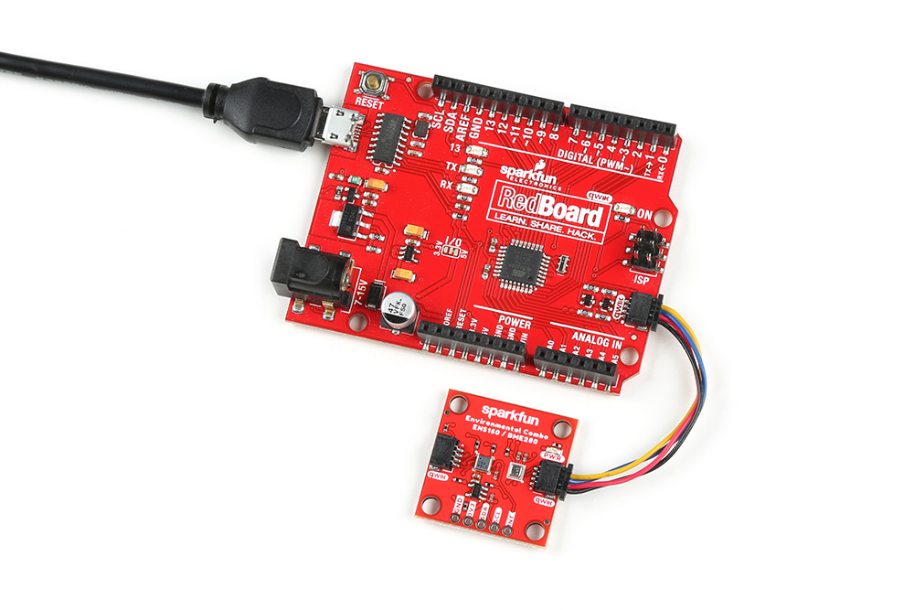

### Connecting via Qwiic

Connecting to the Qwiic Environmental Combo Breakout - ENS160/BME280 is simple. You will just need a microcontroller and a Qwiic cable. In this case, we used an ATmega328P as the microcontroller (we specifically tested the Arduino Libraries with the SparkFun RedBoard Qwiic). Insert one end of the Qwiic cable into the Qwiic Environmental Combo Breakout's Qwiic connector and the other end of the cable to your microcontroller's Qwiic connector. Then insert a USB cable into the RedBoard Qwiic to power and program.

  <table>
    <tr style="vertical-align:middle;">
     <td style="text-align: center; vertical-align: middle;"></td>
    </tr>
  </table>

### Connecting via PTH I2C and Interrupt Pins

!!! note
    For temporary connections to the PTHs, you could use IC hooks to test out the pins. However, you'll need to solder headers or wires of your choice to the board for a secure connection. You can choose between a combination of [header pins and jumper wires](https://learn.sparkfun.com/tutorials/how-to-solder-through-hole-soldering/all), or [stripping wire and soldering the wire](https://learn.sparkfun.com/tutorials/working-with-wire/all) directly to the board.

    

    -   <a href="https://learn.sparkfun.com/tutorials/how-to-solder-through-hole-soldering/all">
          <figure markdown>
            
          </figure>
        </a>

        ---

        <a href="https://learn.sparkfun.com/tutorials/how-to-solder-through-hole-soldering/all">
          <b>How to Solder: Through Hole Soldering</b>
        </a>
    <!-- ----------WHITE SPACE BETWEEN GRID CARDS---------- -->

    -   <a href="https://learn.sparkfun.com/tutorials/working-with-wire/all">
          <figure markdown>
            
          </figure>
        </a>

        ---

        <a href="https://learn.sparkfun.com/tutorials/working-with-wire/all">
          <b>Working with Wire</b>
        </a>
    <!-- ----------WHITE SPACE BETWEEN GRID CARDS---------- -->
    

For users that are connecting to the PTH I2C and interrupt pins on the edge of the board, you will need to connect the RedBoard Qwiic and sensor like the table listed below. For users that are connecting to a different microcontroller, make sure to connect to its respective pins for the I2C and interrupt pins as they may be defined differently.

    <table>
        <tr>
            <th style="text-align: center; border: solid 1px #cccccc;">RedBoard Qwiic
             (I/O set to 3.3V!)
            </th>
            <th style="text-align: center; border: solid 1px #cccccc;">Environmental Combo Breakout  ENS160/BME280 (Qwiic)
            </th>
        </tr>
        <tr>
            <td style="text-align: center; border: solid 1px #cccccc;" bgcolor="#f2dede">3.3V
            </td>
            <td style="text-align: center; border: solid 1px #cccccc;" bgcolor="#f2dede">3.3V
            </td>
        </tr>
        <tr>
            <td style="text-align: center; border: solid 1px #cccccc;" bgcolor="#DDDDDD">GND
            </td>
            <td style="text-align: center; border: solid 1px #cccccc;" bgcolor="#DDDDDD">GND
            </td>
        </tr>
        <tr>
            <td style="text-align: center; border: solid 1px #cccccc;" bgcolor="#fff3cd">SCL (A5)
            </td>
            <td style="text-align: center; border: solid 1px #cccccc;" bgcolor="#fff3cd">SCL
            </td>
        </tr>
        <tr>
            <td style="text-align: center; border: solid 1px #cccccc;" bgcolor="#cce5ff">SDA (A4)
            </td>
            <td style="text-align: center; border: solid 1px #cccccc;" bgcolor="#cce5ff">SDA
            </td>
        </tr>    
        <tr>
            <td style="text-align: center; border: solid 1px #cccccc;" bgcolor="#cce5ff">2
            </td>
            <td style="text-align: center; border: solid 1px #cccccc;" bgcolor="#cce5ff">INT
            </td>
        </tr>
    </table>

Note that you will also need to also make sure that the logic levels are matched to 3.3V if you are not connecting the Qwiic connector (this connector has built-in logic level circuits on the I<up>2C data and clock lines). The default for the RedBoard Qwiic is set to 5V so you will need to cut the trace and add a solder blob between the center pad and the pad close to the 3.3V label.

  <table>
    <tr style="vertical-align:middle;">
     <td style="text-align: center; vertical-align: middle;"></td>
    </tr>
  </table>

!!! note
    For users using the [RedBoard Plus](https://www.sparkfun.com/products/18158), there is a I/O switch available as opposed to an I/O jumper. You could flip the switch toward the 3.3V side to set the logic level as well.
    

      <table>
        <tr style="vertical-align:middle;">
         <td style="text-align: center; vertical-align: middle;"></td>
        </tr>
      </table>
    

