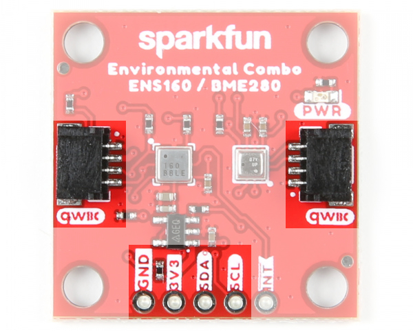

The Environmental Combo Board breaks out the I2C port for the ENS160 and the BME280. The ScioSense's ENS160 is populated on the left side below the label ENS160. The independent hotplate control allows the detection of volatile organic compounds (VOCs) including ethanol, toluene, hydrogen and oxidizing gases with superior sensitivity. The ENS160 supports intelligent algorithms to process raw sensor measurements on-chip. These algorithms calculate <a href="../assets/component_documentation/ENS160-White-Paper.pdf">CO2-equivalents, TVOC, air quality indices (AQIs)</a> and perform humidity and temperature compensation, as well as baseline management, all on chip. Raw sensor measurements can be read for further customization. Bosch's BME280 is populated on the right side below the label BME280. The BME280 measures three different atmospheric properties: [ambient temperature](https://en.wikipedia.org/wiki/Atmospheric_temperature), [relative humidity](https://en.wikipedia.org/wiki/Relative_humidity), and [barometric pressure](https://en.wikipedia.org/wiki/Atmospheric_pressure). The BME280 can also calculate altitude changes, or absolute altitude if the locally reported barometric pressure is known.

  <table>
    <tr style="vertical-align:middle;">
     <td style="text-align: center; vertical-align: middle;"></td>
     <td style="text-align: center; vertical-align: middle;"></td>
    </tr>
    <tr style="vertical-align:middle;">
     <td align="center">ENS160 Highlighted</td>
     <td align="center">BME280 Highlighted</td>
    </tr>
  </table>

Let's look over a few characteristics of the Environmental Combo Breakout - ENS160/BME280 (Qwiic) sensor so we know a bit more about how it behaves. These characteristics were taken from their respective datasheets. For more information, make sure to check out the datasheet that is linked in the Resources section.

* **ENS160**
    * I2C Addresses: **0x53 (Default)** or 0x52
    * Wide Operating Ranges
        * VDD: 1.71 1.98V
        * VDDIO: 1.71V to 3.6V
        * Temperature: -40&deg;C to +85&deg;C
        * Humidity: 5% to 95% (non-condensing)
    * IAQ standard compliance for AQI, eCO2, and TVOC
        * Air Quality Index - Umweltbundesamt (AQI-UBA)
            * Range: 1 to 5
            * Resolution: 1
        * Equivalent Carbon Dioxide (eCO2)
            * Range: 400 to 65,000 ppm
            * Resolution: 1 ppm
        * Total Volatile Organic Compound (TVOC)
            * Range: 0 to 65,000 ppb
            * Resolution: 1 ppb
    * Immunity to humidity and ozone
        * Superior output stability over the whole temperature and relative humidity operating ranges
        * Effective ozone compensation
    * Independent sensor heater control for highest VOC selectivity and outstanding background discrimination
* **BME280**
    * VDD: 1.71V to 3.6V
    * VDDIO: 1.2V to 3.6V
    * I2C Addresses: **0x77 (Default)** or 0x76
    * Temperature
        * Operating Range: -40&deg;C to 85&deg;C
        * Full accuracy to &plusmn; 0.5&deg;C from -0&deg;C to 65&deg;C
        * Resolution 0.01&deg;C
    * Humidity
        * Operating Range: 0% to 100% RH
        * Accurate to &plusmn;3% from 20% -80% RH
        * Resolution: 0.008%RH
    * Pressure
        * Operating Range: 30,000 Pa to 110,000Pa
        * Absolute Accuracy of &plusmn;100Pa
        * Relative Accuracy of &plusmn;12Pa
        * Resolution: 0.18Pa
    * Altitude Range
        * 0ft to 30,000ft (9.2km)
        * Relative accuracy of 3.3ft (1m) at sea level, 6.6 (2m) at 30,000ft

### Power

To power the board, you will need **3.3V**. You can power the board via either Qwiic connector. For users that need to solder directly to the board and do not have a Qwiic connector populated on the microcontroller, the pins are also broken out on the edge PTH. Voltage is regulated down to 1.8V for the ENS160 with the AP2127K voltage regulator. The logic levels of each sensor is 3.3V.

  <table>
    <tr style="vertical-align:middle;">
     <td style="text-align: center; vertical-align: middle;"></td>
    </tr>
  </table>

### I2C and Qwiic Connectors

The board includes two Qwiic connectors on each side of the board. For users that need to solder directly to the board, the pins are also broken out on the edge PTH. The I2C data and clock lines are also tied to 2.2k&ohm; pull-up resistors.

  <table>
    <tr style="vertical-align:middle;">
     <td style="text-align: center; vertical-align: middle;"></td>
    </tr>
  </table>

*  The default address of the ENS160 is set to **0x53**. Its alternative address is _0x52_. The default address of the BME280 is set to **0x77**. Its alternative address is _0x76_. For more information, check out the section about the jumpers.

!!!note
    While both sensors are capable of SPI, we opted to only focus on using the sensors with I2C so only the I2C pins are broken out.

### Interrupt Pin

The interrupt pin is also broken out for the ENS160 and it is active when the pin is low.

  <table>
    <tr style="vertical-align:middle;">
     <td style="text-align: center; vertical-align: middle;"></td>
    </tr>
  </table>

### LED

There is one LED on the board. The LED lights up when the board is powered with 3.3V. There is a jumper on the back if you decide to disable the LED.

  <table>
    <tr style="vertical-align:middle;">
     <td style="text-align: center; vertical-align: middle;"></td>
    </tr>
  </table>

### Jumpers

There are a few jumper pads available on the bottom of the board. For more information on modifying the jumpers, check out our [tutorial on working with jumper pads and PCB traces](https://learn.sparkfun.com/tutorials/how-to-work-with-jumper-pads-and-pcb-traces).

* **LED** &mdash; The LED jumper is closed by default. Cut this trace to disable the power LED that is connected to 3.3V.
* **I2C** &mdash; The I2C jumpers are closed by default. By cutting the traces between the jumper pads, it will disconnect to the 2.2kΩ pull-up resistors for the I2C bus. Most of the time you can leave these alone unless your project requires you to [connect the pull-up resistors](https://learn.sparkfun.com/tutorials/i2c/all#i2c-at-the-hardware-level).
* **BME ADR** &mdash; This is the BME280 address select jumper. It is open by default so the address is `0x77`. By closing this jumper, the address changes to `0x76`. Make sure to also modify your code to adjust for the alternative address.
* **ENS ADR** &mdash; This is the ENS160 address select jumper. The center pad is connect to the right pad labeled as `0x53`. To use the sensor's alternative address, you will need to cut this jumper and adding a solder blob to between the center pad and the pad located on the left labeled `0x52`. If the center of the pad is left floating, the address will be undefined. Make sure to also modify your code to adjust for the alternative address.

  <table>
    <tr style="vertical-align:middle;">
     <td style="text-align: center; vertical-align: middle;"></td>
    </tr>
  </table>

### Board Dimensions

The board is 1.0" x 1.0" (25.4mm x 25.4mm). There are 4x mounting holes by each corner of the board.

  <table>
    <tr style="vertical-align:middle;">
     <td style="text-align: center; vertical-align: middle;"></td>
    </tr>
  </table>

